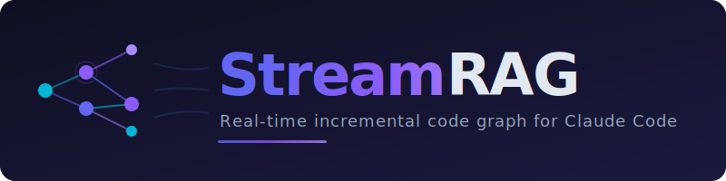

<div align="center">



<br/><br/>

**Real-time incremental code graph that gives Claude Code structural superpowers.**

<br/>

[](https://python.org)
[](LICENSE)
[](pyproject.toml)
[](tests/)
[](#-supported-languages)
[](#quick-install)

<br/>

<h3>
<code>0.05ms</code> per update &nbsp;&bull;&nbsp; <code>26x</code> faster than batch &nbsp;&bull;&nbsp; <code>597</code> tests passing
</h3>

</div>

<br/>

---

<br/>

<div align="center">

## Quick Install

</div>

```bash
claude plugin marketplace add Krrish109/StreamRAG
claude plugin install streamrag@streamrag
```

> **That's it.** Restart Claude Code — StreamRAG activates automatically on every session. No config needed.

<br/>

---

<br/>

## The Problem

Claude Code is powerful but **flies blind on code structure**. It greps for callers, guesses at dependencies, and can't reliably answer *"what breaks if I change this?"*

For large codebases, this means wasted context window on exploration and missed dependencies on refactors.

## The Solution

StreamRAG maintains a **live dependency graph** that updates incrementally on every edit. Instead of re-scanning the whole project, it computes the minimal AST diff and surgically patches only the changed nodes and edges.

<br/>

<table>
<tr>
<td width="50%">

### &cross; Without StreamRAG

```
User: "What calls validate()?"

Claude: Let me search for that...
  → grep -r "validate" --include="*.py"
  → Found 47 matches (includes comments,
    strings, variable names...)
  → Let me grep more specifically...
  → grep -r "validate(" --include="*.py"
  → Still 23 matches to sift through...
```

<br/>

> **Multiple grep rounds** &bull; False positives &bull; No transitive deps &bull; Burns context window

</td>
<td width="50%">

### &check; With StreamRAG

```
User: "What calls validate()?"

Claude: [instant graph lookup]

  Callers of validate (3):
    auth_service.py → login()     [high]
    auth_service.py → register()  [high]
    middleware.py   → check_auth() [high]

  Affected files: 5
```

> **Instant answer** &bull; Only real relationships &bull; Confidence-scored &bull; Zero cost

</td>
</tr>
</table>

<br/>

---

<br/>

<div align="center">

## Performance

</div>

<br/>

<div align="center">
<table>
<tr>
<td align="center" width="16%">
<br/>
<h2>0.05ms</h2>
<sub><b>Per Incremental<br/>Update</b></sub>
<br/><br/>
</td>
<td align="center" width="16%">
<br/>
<h2>26x</h2>
<sub><b>Faster Than<br/>Batch Rebuild</b></sub>
<br/><br/>
</td>
<td align="center" width="16%">
<br/>
<h2>200x</h2>
<sub><b>Under 10ms<br/>Latency Target</b></sub>
<br/><br/>
</td>
<td align="center" width="16%">
<br/>
<h2>~6,700</h2>
<sub><b>Lines of<br/>Production Code</b></sub>
<br/><br/>
</td>
<td align="center" width="16%">
<br/>
<h2>597</h2>
<sub><b>Tests<br/>Passing</b></sub>
<br/><br/>
</td>
<td align="center" width="16%">
<br/>
<h2>0</h2>
<sub><b>External<br/>Dependencies</b></sub>
<br/><br/>
</td>
</tr>
</table>
</div>

<br/>

---

<br/>

<div align="center">

## Key Features

</div>

<br/>

<table>
<tr>
<td width="33%" valign="top">
<h3 align="center">Incremental Updates</h3>
<p align="center">Every <code>Edit</code>/<code>Write</code> triggers a surgical graph patch. Only changed entities are reprocessed — <b>no full rebuilds ever</b>.</p>
</td>
<td width="33%" valign="top">
<h3 align="center">16 Query Commands</h3>
<p align="center">Callers, callees, impact analysis, dead code, cycles, shortest path, exports, natural language queries, and more.</p>
</td>
<td width="33%" valign="top">
<h3 align="center">7 Languages</h3>
<p align="center">Python (full AST), TypeScript, JavaScript, Rust, C++, C, and Java with shared regex infrastructure.</p>
</td>
</tr>
<tr>
<td width="33%" valign="top">
<h3 align="center">Proactive Intelligence</h3>
<p align="center">Automatic cycle detection, dead code warnings, and breaking change alerts on every edit — <b>before you ask</b>.</p>
</td>
<td width="33%" valign="top">
<h3 align="center">Rich Context Injection</h3>
<p align="center">When Claude reads a file, StreamRAG injects entity signatures, callers, imports, and affected files.</p>
</td>
<td width="33%" valign="top">
<h3 align="center">Persistent Graph</h3>
<p align="center">Graph state saves to <code>~/.claude/streamrag/</code> and restores automatically. Survives restarts.</p>
</td>
</tr>
</table>

<br/>

---

<br/>

<div align="center">

## Quick Start

</div>

StreamRAG activates **automatically**. On your first file edit, it scans the project (up to 200 files, <7s) and builds the initial graph. After that, every edit updates incrementally.

```bash
# Check graph status
/streamrag

# Ask about code relationships
/streamrag-ask what calls process_change

# Get context for a specific file (auto-invoked by Claude)
/streamrag-context
```

<br/>

---

<br/>

<div align="center">

## Query Reference

</div>

<br/>

| Command | Description | Example |
|:--------|:-----------|:--------|
| `callers <name>` | Who calls / imports / inherits this | `callers validate` |
| `callees <name>` | What does this entity call / import | `callees AuthService` |
| `deps <file>` | Forward file dependencies | `deps auth/service.py` |
| `rdeps <file>` | Reverse deps (what depends on this) | `rdeps models.py` |
| `impact <file>` | Transitive impact analysis | `impact core/auth.py` |
| `dead` | Find unused functions and classes | `dead --all` |
| `cycles` | Detect circular file dependencies | `cycles` |
| `path <src> <dst>` | Shortest dependency chain | `path UserModel validate` |
| `file <file>` | All entities in a file | `file server.py` |
| `entity <name>` | Full detail for an entity | `entity DeltaGraphBridge` |
| `search <regex>` | Find entities by pattern | `search "test_.*"` |
| `exports <file>` | Module exports (`__all__`) | `exports utils.py` |
| `stats` | Graph statistics | `stats` |
| `ask "<question>"` | Natural language query | `ask "what calls foo"` |
| `visualize <file>` | Generate Mermaid / DOT diagrams | `visualize --format mermaid` |
| `summary` | Architecture overview | `summary` |

> **Name resolution** is progressive: exact match → suffix match → regex fallback.
> Use bare names (`callers foo`), qualified names (`callers Bar.foo`), or patterns (`search "test_.*"`).

<br/>

---

<br/>

<div align="center">

## Supported Languages

</div>

<br/>

<div align="center">
<table>
<tr>
<th>Language</th>
<th>Method</th>
<th>Functions</th>
<th>Classes</th>
<th>Imports</th>
<th>Inheritance</th>
<th>Calls</th>
<th>Types</th>
<th>Decorators</th>
</tr>
<tr>
<td><b>Python</b></td>
<td>Full AST</td>
<td align="center">&#10003;</td><td align="center">&#10003;</td><td align="center">&#10003;</td><td align="center">&#10003;</td><td align="center">&#10003;</td><td align="center">&#10003;</td><td align="center">&#10003;</td>
</tr>
<tr>
<td><b>TypeScript</b></td>
<td>Regex</td>
<td align="center">&#10003;</td><td align="center">&#10003;</td><td align="center">&#10003;</td><td align="center">&#10003;</td><td align="center">&#10003;</td><td align="center">&#10003;</td><td align="center">&#10003;</td>
</tr>
<tr>
<td><b>JavaScript</b></td>
<td>Regex</td>
<td align="center">&#10003;</td><td align="center">&#10003;</td><td align="center">&#10003;</td><td align="center">&#10003;</td><td align="center">&#10003;</td><td align="center">—</td><td align="center">&#10003;</td>
</tr>
<tr>
<td><b>Rust</b></td>
<td>Regex</td>
<td align="center">&#10003;</td><td align="center">&#10003;</td><td align="center">&#10003;</td><td align="center">&#10003;</td><td align="center">&#10003;</td><td align="center">—</td><td align="center">&#10003;</td>
</tr>
<tr>
<td><b>C++</b></td>
<td>Regex</td>
<td align="center">&#10003;</td><td align="center">&#10003;</td><td align="center">&#10003;</td><td align="center">&#10003;</td><td align="center">&#10003;</td><td align="center">—</td><td align="center">—</td>
</tr>
<tr>
<td><b>C</b></td>
<td>Regex</td>
<td align="center">&#10003;</td><td align="center">&#10003;</td><td align="center">&#10003;</td><td align="center">—</td><td align="center">&#10003;</td><td align="center">—</td><td align="center">—</td>
</tr>
<tr>
<td><b>Java</b></td>
<td>Regex</td>
<td align="center">&#10003;</td><td align="center">&#10003;</td><td align="center">&#10003;</td><td align="center">&#10003;</td><td align="center">&#10003;</td><td align="center">—</td><td align="center">&#10003;</td>
</tr>
</table>
</div>

<br/>

---

<br/>

<div align="center">

## How It Works

</div>

<br/>

<p align="center">
  
</p>

### The Incremental Pipeline

Traditional code intelligence rebuilds the entire index on every change. StreamRAG takes a fundamentally different approach:

```
  Edit file  →  Extract AST  →  Compute Delta  →  Patch Graph  →  Resolve Edges  →  Propagate
     │              │                │                 │                │                │
   0.00ms        0.02ms           0.01ms            0.01ms          0.01ms           0.00ms
```

1. **Extract** — Parse old and new file into entity lists (functions, classes, imports, variables)
2. **Diff** — Compute minimal delta: added, removed, modified, or renamed entities
3. **Patch** — Surgically update only affected nodes and edges
4. **Resolve** — Two-pass edge resolution links calls, imports, and inheritance across files
5. **Propagate** — Bounded propagation re-parses affected dependent files

### Edge Types

| Edge | Meaning | Example |
|:-----|:--------|:--------|
| `calls` | Function/method call | `login()` → `validate()` |
| `imports` | Import linked to definition | `from auth import validate` → `def validate` |
| `inherits` | Class inheritance | `class Admin(User)` → `class User` |
| `uses_type` | Type annotation reference | `def foo(u: User)` → `class User` |
| `decorated_by` | Decorator relationship | `@cache` → `def cache` |

### Semantic Intelligence

- **Rename detection** — Distinguishes renames from delete + add pairs using position overlap + structure hash
- **Semantic diffing** — Ignores whitespace-only and comment-only changes (zero false updates)
- **ShadowAST** — Binary-search partial parser recovers entities from broken mid-edit code
- **Confidence scoring** — Every edge gets `high` / `medium` / `low` based on resolution certainty

<br/>

---

<br/>

<div align="center">

## Hook Integration

</div>

<br/>

StreamRAG plugs into Claude Code via four transparent hooks:

| Hook | Trigger | Action |
|:-----|:--------|:-------|
| **PostToolUse** | `Edit` `Write` `MultiEdit` | Incremental graph update + proactive warnings |
| **PreToolUse** | `Read` | Inject callers, deps, affected files into context |
| **PreToolUse** | `Task` `Grep` | Redirect relationship queries to graph |
| **Stop** | Session end | Serialize graph summary for persistence |

<br/>

---

<br/>

<div align="center">

## Architecture

</div>

```
streamrag/
├── bridge.py              # DeltaGraphBridge — incremental graph maintenance engine
├── graph.py               # CodeGraph — node/edge storage, traversal, cycle detection
├── extractor.py           # ASTExtractor — full Python AST entity extraction
├── models.py              # Core data models (ASTEntity, GraphNode, GraphEdge, CodeChange)
├── smart_query.py         # Natural language → command router (30+ regex patterns)
├── daemon.py              # Persistent asyncio daemon (Unix domain socket IPC)
├── daemon_client.py       # Synchronous client for hook scripts
│
├── storage/
│   └── memory.py          # JSON serialization, persistence at ~/.claude/streamrag/
│
├── agent/
│   └── context_builder.py # Rich context formatting for pre-read hook injection
│
├── languages/
│   ├── base.py            # LanguageExtractor ABC
│   ├── registry.py        # ExtractorRegistry — auto-detect by file extension
│   ├── regex_base.py      # RegexExtractor — shared infrastructure for non-Python
│   ├── python.py          # Python (full AST)
│   ├── typescript.py      # TypeScript / TSX
│   ├── javascript.py      # JavaScript
│   ├── rust.py            # Rust
│   ├── cpp.py             # C++
│   ├── c.py               # C
│   └── java.py            # Java
│
└── v2/
    ├── versioned_graph.py      # Version tracking + conflict detection
    ├── hierarchical_graph.py   # HOT/WARM/COLD zone management
    ├── bounded_propagator.py   # Priority-queue cascade prevention
    ├── shadow_ast.py           # Binary-search partial parser for broken code
    ├── operations.py           # Fine-grained operations with rollback
    └── semantic_path.py        # LEGB-like scope resolution
```

<br/>

---

<br/>

<div align="center">

## StreamRAG vs Grep

</div>

<br/>

| Task | StreamRAG | Grep/Glob |
|:-----|:---------:|:---------:|
| "What calls this function?" | **`callers <name>`** | &#10007; |
| "What files break if I change this?" | **`impact <file>`** | &#10007; |
| "Show dependency chain A → B" | **`path <src> <dst>`** | &#10007; |
| "What does this class inherit?" | **`callees <name>`** | &#10007; |
| "Find dead code" | **`dead`** | &#10007; |
| "Circular dependencies?" | **`cycles`** | &#10007; |
| "Architecture overview" | **`summary`** | &#10007; |
| "Find a file by name" | &#10007; | **`glob`** |
| "Search for a string literal" | &#10007; | **`grep`** |
| "Find a TODO comment" | &#10007; | **`grep`** |

<br/>

---

<br/>

<div align="center">

## Research Paper

A comprehensive IEEE-format research paper is included in [`paper/`](paper/).

Covers the full architecture, algorithms, formal definitions, benchmarks, and TikZ diagrams.

<br/>

## License

[MIT](LICENSE) — Built by [Krrish Choudhary](https://github.com/Krrish109)

<br/>

**If StreamRAG helps you, give it a ⭐**

</div>
